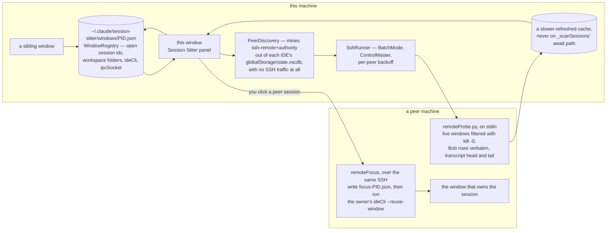
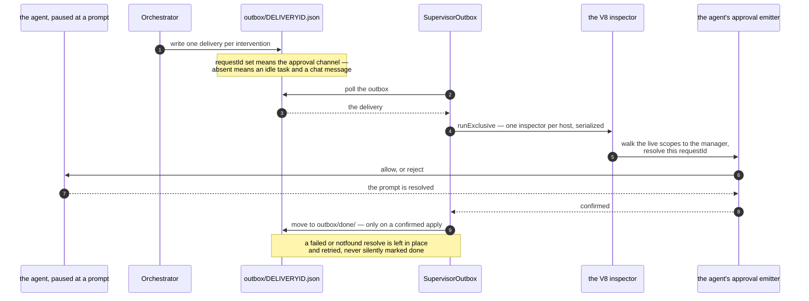

# Architecture: Session Sitter

<p align="center">
  
</p>

## Overview

The extension does two things.

**It shows you your agent sessions.** Claude Code, IBM Bob, Codex and VS Code Chat each keep
their own session store, and none of them shows you a list of what is alive across windows. The
panel does: one worklist of the sessions you can act on right now, everything else under History,
one click to switch.

**It supervises what those agents pause on.** When an agent stops for approval, the extension
classifies that specific pending action into a traffic light — green, yellow, orange, red —
against knowledge learned from your team's past sessions, and applies the outcome back into the
agent. Orange reaches a human asynchronously with a countdown, and silence is never treated as
approval.

Two design rules shape everything below:

1. **For reading sessions: read what the agents already write to disk.** No reimplementation of
   their internals.
2. **For acting on a blocked session: use the agent's own join point.** A task blocked at a
   permission prompt cannot be reached by a chat message; the only channel that works is the
   agent's own approval emitter, reached in-process through the V8 inspector.

---

## Project Structure

```
session-sitter/
├── src/
│   ├── extension.ts                    # activate() — wires everything together
│   ├── SessionManager.ts               # the four session stores; scanning + transcripts
│   ├── SessionSitterViewProvider.ts  # the sidebar webview + the activity feed
│   ├── sessionRows.ts                  # Bob rows -> sessions, shared local + remote
│   ├── sessionActivity.ts              # active worklist vs History (pure; panel + Telegram)
│   ├── sessionSort.ts                  # the session-list orders (pure, total comparators)
│   ├── workspaceColors.ts              # per-workspace pill colour (pure)
│   ├── WindowRegistry.ts               # cross-window focus + published open-session ids
│   ├── BobDatabase.ts                  # the one read-only SQLite shim (see below)
│   ├── AutoResponder.ts                # text rules, approval rules, supervisor handoff
│   ├── SessionExporter.ts              # the full-transcript export contract
│   ├── SupervisionService.ts           # drives the supervisor in-process
│   ├── SupervisorOutbox.ts             # applies supervisor decisions into the agent
│   ├── SupervisionActivity.ts          # records/ -> the panel's activity feed
│   ├── agents/                         # per-IDE live-process bridges (V8 inspector)
│   │   ├── BobInspector.ts    BobSender.ts     BobApprover.ts
│   │   ├── ClaudeInspector.ts ClaudeSender.ts  ClaudeApprover.ts
│   │   └── QuestionProbe.ts            # read-only probes for debugging the bridges
│   ├── supervisor/                     # the runtime supervisor — pure TypeScript
│   │   ├── models.ts      timeutil.ts   schema.ts     questions.ts
│   │   ├── transcript.ts  knowledge.ts  tiers.ts      prompt.ts
│   │   ├── engine.ts      store.ts      messaging.ts  telegram.ts
│   │   ├── agentControl.ts orchestrator.ts config.ts  factory.ts
│   │   ├── ruleDecisions.ts            # the deterministic tier's records + reports
│   │   ├── sessionIdentity.ts          # which session, on which machine — one format
│   │   └── cli.ts                      # node out/supervisor/cli.js run|poll
│   ├── telegram/                       # the remote interface (off by default)
│   │   ├── ownership.ts                # which window is responsible for a session (pure)
│   │   ├── lease.ts                    # elects ONE Telegram reader per machine
│   │   ├── bus.ts                      # cross-window commands, claimed by atomic rename
│   │   ├── topics.ts                   # session <-> forum topic, and the mirror cursor
│   │   ├── render.ts                   # every message a human sees (pure)
│   │   ├── intent.ts                   # update -> intent, and the authorisation boundary
│   │   ├── forum.ts                    # the Telegram Topics calls, over the shared ApiFn
│   │   ├── applyCommand.ts             # what the owning window does with a command
│   │   ├── updateRouter.ts             # splits the ONE update stream: ours vs supervision's
│   │   ├── topicRoutedChannel.ts       # posts a supervision card into its session's topic
│   │   ├── launcher.ts                 # the only file here that touches vscode.commands
│   │   └── RemoteControlService.ts     # the loop: mirror, apply, and (as reader) poll
│   ├── corpus/                         # session corpus tooling
│   │   ├── upload.ts  mask.ts  cli.ts
│   └── webview/
│       ├── main.js                     # tab strip, history, activity feed
│       ├── toolbarMenu.js              # the ☰ menu (About + Settings…)
│       └── styles.css                  # theme-aware styles
├── src/test/                           # vitest; no network, no real agent, no VS Code
├── knowledge/                          # BDI tier template + registry example
├── skills/kb-sitter/                   # the knowledge-loader skill
└── docs/
```

Everything in this repository is TypeScript. See
[Why one `python3` call remains](#why-one-python3-call-remains).

---

## Session Detection: How We Know What's Running

This is the core problem the extension solves, and it required more depth than expected.

### The files Claude Code writes

**`~/.claude/sessions/<pid>.json`** — created for each active Claude process:

```json
{
  "pid": 1641086,
  "sessionId": "3bfad019-767d-4942-9c40-fb5ccb313ee1",
  "cwd": "/home/user/my-project",
  "startedAt": 1781443340390,
  "procStart": "33842439",
  "entrypoint": "claude-vscode",
  "kind": "interactive"
}
```

**`~/.claude/ide/<port>.lock`** — created by the VS Code extension host when it connects:

```json
{
  "pid": 6486,
  "workspaceFolders": ["/home/user/my-project"],
  "transport": "ws",
  "authToken": "..."
}
```

**`~/.claude/projects/<encoded-path>/<uuid>.jsonl`** — the session transcript, newline-delimited JSON.

### The detection algorithm (`getActiveSessionIds`)

```
For each file in ~/.claude/sessions/:
  1. Parse pid, sessionId, procStart, entrypoint, startedAt
  2. Skip if entrypoint != "claude-vscode"          (ignore CLI sessions)
  3. Skip if startedAt < (now - 24h)                (ignore zombie processes)
  4. process.kill(pid, 0)  →  throws if dead         (PID liveness check)
  5. Collect every surviving candidate, then cross-check its start time:
       on Linux    /proc/<pid>/stat field 21 == procStart   (kernel jiffies since boot)
       elsewhere   one `ps -o pid=,lstart=` for all of them, compared as instants
  6. Skip on a mismatch                              (PID recycling guard)
  7. Add sessionId to the active set
```

The `procStart` comparison is the key insight: an OS can reuse a PID after a process dies. By storing and comparing the process start-time, we can distinguish the *original* Claude process from an unrelated process that happened to get the same PID later.

Step 5 branches because `/proc` is Linux-only, and reading it on macOS threw for every session, which judged the whole worklist dead. The `ps` path asks about every candidate PID in **one** spawn, because this runs on a 5 s poll. Two details it has to get right: Claude writes `procStart` in UTC while `ps` prints the machine's local zone, so the two are compared as instants rather than as text; and when `ps` cannot be run, or says nothing parsable about a PID, the `kill(pid, 0)` signal alone decides — losing the recycling guard beats losing the feature.

### Why not VS Code's tab API?

`vscode.window.tabGroups` would give us tab titles and viewTypes directly. It doesn't work from the remote (WSL) extension host — window APIs are local-host-only. The `~/.claude/sessions/` approach works from the remote host because it reads the local filesystem.

### Fallback chain

```
1. Tab API (duck-typed viewType check)      →  if it produces matches: use tab titles
2. ~/.claude/sessions/ PID liveness         →  primary detection (always tried)
3. 2-hour recency window                    →  last resort if session files unreadable
```

---

## Session Data: Reading JSONL Files

### File location

```
~/.claude/projects/<encoded-workspace-path>/<session-uuid>.jsonl
```

The workspace path is encoded by replacing every `/` with `-`, so `/home/user/project` becomes `-home-user-project`.

### Parsing strategy

The extension reads in 16 KB chunks up to 256 KB, looking for two record types:

**`user` record** (first user message → fallback title):
```json
{
  "type": "user",
  "message": { "content": [{"type": "text", "text": "Fix the auth bug"}] },
  "cwd": "/home/user/project"
}
```

**`ai-title` record** (Claude Code's AI-generated title, preferred):
```json
{
  "type": "ai-title",
  "aiTitle": "Fix authentication bug"
}
```

Once both are found (or 256 KB is read), parsing stops. The `ai-title` matches what Claude Code shows in its tab bar.

### Status detection

The last 32 KB of the file is read and scanned *backward* for the most recent meaningful record:

| Last record type | Status | Indicator |
|---|---|---|
| `tool_use` or `tool_result` | `active` | 🟢 spinning ring |
| `assistant` with `tool_use` in content | `active` | 🟢 spinning ring |
| `assistant` + file modified < 30 s ago | `active` | 🟢 spinning ring (still streaming) |
| `user` | `waiting` | 🟡 pulsing dot |
| `pr-link` or `last-prompt` | `idle` | ⚫ dim dot |
| `assistant` + quiet 30 s+ | `idle` | ⚫ dim dot |

The `pr-link` and `last-prompt` records are terminal markers written by Claude CLI at task completion — seeing them means the session is definitively done even if a `user` record appears earlier in the file.

The 32 KB tail (vs the original 2 KB) is necessary because VS Code sessions write large `file-history-snapshot` records that would otherwise push recognizable records out of a smaller window.

### Excluded paths

The recursive JSONL scan skips directories named `subagents/` — these contain transcript files for parallel agent calls, not user-facing sessions.

---

## Components

### `SessionManager`

All session data, no UI. Owns:

- **Initial scan** on construction — async, fires `onDidChangeSessions` when done
- **FileSystemWatcher** on `~/.claude/projects/**/*.jsonl` — fast path for changes
- **5-second polling loop** — fallback for WSL2 where file watchers silently stop
- **Fingerprint comparison** — only fires `onDidChangeSessions` when sessions actually changed (avoids unnecessary redraws)
- **`getActiveSessionIds()`** — the PID liveness check described above
- **`getActiveWorkspacePaths()`** — workspace-level detection via `~/.claude/ide/*.lock` (used as secondary signal)

```typescript
interface ClaudeSession {
  sessionId: string;    // UUID from filename
  projectName: string;  // last segment of cwd
  projectPath: string;  // full cwd
  title: string;        // ai-title if available, else first user message (≤60 chars)
  updatedAt: Date;      // file mtime
  // Whose turn it is, and why. Six states, derived in `sessionStatus.ts`.
  status: 'approval' | 'question' | 'finished' | 'working' | 'seen' | 'dormant';
}
```

Status is derived by [`sessionStatus.ts`](../src/sessionStatus.ts) — a pure module with no `vscode`,
no I/O and no clock of its own, so all six states are unit-testable. `SessionManager` does the
reading (the transcript tail, the Bob rows); that module does the deciding. Every rule, per agent,
is documented in [`STATUS-INDICATORS.md`](STATUS-INDICATORS.md).

### Active or History

Whether a session belongs in the live worklist or in History is a separate question from what its
status is, and it lives in [`sessionActivity.ts`](../src/sessionActivity.ts) — also pure, also given
its live signals as arguments.

It is a module rather than a closure in the view provider because **two** surfaces ask it: the panel
and Telegram. That was the bug the split fixed — the panel showed a tight worklist while Telegram
showed every session it had ever seen, so the two disagreed about one fleet and neither could be
trusted. `SessionSitterViewProvider.sessionPartition()` gathers the live signals (the Bob and Claude
probes, the window registry, the probeless window setting), applies the rule, and hands the same two
lists to both surfaces.

One of those signals needs a word of warning, because it reads as stronger than it is. A window
entry proves its **publisher** is running, which on a remote IDE is not the same as a person being
there: the extension host lives on the server, survives the client window closing, and goes on
republishing the tabs that were open when you disconnected. Two things bound that. `sessionActivity`
makes an open-tab report expire — past `STALE_FALLBACK_WINDOW_MS` it only still counts for a
`working` session or one blocked on you. And each entry carries `lastActiveAt`, from
`vscode.window.state`, which stops advancing when nobody is at the window;
`sessionSitter.windowAttentionMinutes` decides how long a report survives that silence, and ships at
`0`, meaning off.

### `SessionSitterViewProvider`

Implements `WebviewViewProvider`. Wires `SessionManager` events and the VS Code tab API to the webview.

**Incoming events that trigger a refresh:**
- `sessionManager.onDidChangeSessions` — file content changed
- `vscode.window.tabGroups.onDidChangeTabs` — Claude Code tab opened/closed/renamed

**Messages from webview → extension:**

| Message | Action |
|---|---|
| `switchSession` | `claude-vscode.primaryEditor.open(sessionId)` |
| `newSession` | `claude-vscode.newConversation` |
| `removeTab` | Close the Claude Code editor tab via `tabGroups.close()` |
| `loadHistory` | Query sessions not in the live set, push `updateHistory` |
| `addFromHistory` | `claude-vscode.primaryEditor.open(sessionId)` |
| `setSessionSort` | Validate the mode, write `sessionSitter.sessionSort` (global), re-push both lists |

The provider also owns the **display status**: it folds a live pending approval (from
`PendingWatcher`) and your last-viewed stamps (from `context.globalState`) into each session's
state, once, on the way out — so the worklist filter, the sort and the row can never disagree about
a session. A live signal may upgrade a state; its absence never downgrades one, because the probe
only sees its own window.

**Session list logic:**
```
1. Check VS Code tabs for claudeVSCodePanel viewType → if matches found, show those
2. Otherwise: call getActiveSessionIds() → show sessions with live PIDs
3. Fallback: status is 'approval'/'question' (any age — blocked, not stale),
   or 'working' and modified < 2h
```

### Webview (`main.js` + `styles.css`)

Plain HTML/CSS/JS — no framework, no build step. Communicates exclusively via `acquireVsCodeApi().postMessage()`.

**UI layout:**
```
[ + ]                           ← new session button
[ Fix auth bug  claude-proj  × ]  ← session row (title + project badge + close)
[ Count to 20   claude-proj  × ]
[ Implement X   demo-project   × ]
[ History ▼ ]                   ← collapsible
  [ Past session 1              ]
  [ Past session 2              ]
```

Session rows respond to `updateSessions` messages. History responds to `updateHistory`. Both are pushed by the provider.

---

## Session Switching Flow

```
User clicks a session row
  → webview: postMessage({ type: 'switchSession', sessionId })
  → SessionSitterViewProvider
  → vscode.commands.executeCommand('claude-vscode.primaryEditor.open', sessionId)
  → Claude Code's createPanel():
      if sessionPanels.get(sessionId) exists → panel.reveal()   (same window)
      else → createWebviewPanel(... ViewColumn.Active ...)        (new editor tab)
  → Claude Code embeds sessionId in panel HTML as data-initial-session
  → Webview loads and resumes the session
```

The background session's Claude process was never stopped — `retainContextWhenHidden: true` kept its webview state alive. Switching is just making the panel visible again.

---

## Key Design Decisions

**Why read `~/.claude/sessions/` instead of watching JSONL mtime?**
JSONL mtime tells you *when* a session was last active, not *whether* it's running now. A session that finished 3 hours ago has an old mtime. A session that's been idle since morning but never closed has an old mtime too. PID liveness is the ground truth.

**Why the `procStart` check?**
Linux recycles PIDs. Without this check, a new unrelated process that happens to get an old Claude PID would appear as a "live" session. The kernel start-time stored in `procStart` makes the check unique per process instance.

**Why 24-hour `startedAt` filter?**
VS Code process trees can survive for days in WSL without a full restart. Sessions opened in a previous VS Code session accumulate as background processes. The 24-hour window filters these out — if you want them, they're in History.

**Why `claude-vscode.primaryEditor.open` instead of `vscode.env.openExternal`?**
`openExternal` with a `vscode://` URI goes through the OS URI handler, which may open a new VS Code window if multiple instances are running. The command executes directly in the correct extension host and calls `createPanel()` in the same window.

**Why not `vscode.window.tabGroups`?**
This API only works from the local (Windows) extension host. Our extension runs in the remote (WSL) extension host to access the WSL filesystem. The two can't run in the same host simultaneously without a significant refactor to use `vscode.workspace.fs` for all file I/O.

---

## Cross-machine sessions

Running in the remote extension host is what lets this extension read the remote filesystem — and
it is also why one window cannot see another machine's sessions. Every source is rooted at
`os.homedir()`, so one extension host per machine means one `$HOME` per machine.

Peer machines are therefore pulled explicitly. `sessionSitter.remotePeers` (`auto` by default,
`off` to disable everything below) gates it, and the gate **fails closed**: if the setting cannot be
read at all, no SSH happens.



Three things in that picture are load-bearing. The registry is a **directory of files, not a
service** — a window that dies leaves a stale file, not a broken socket. The probe returns **raw
material, not sessions**, so titles and statuses are still derived by the one implementation in
`sessionRows.ts`. And the peer path reaches the panel through a **cache**, because `_scanSessions`
awaits its sources in sequence and an SSH round trip on that path would stall the local list behind
the network.

| Unit | Job |
| --- | --- |
| `remote/PeerDiscovery.ts` | find peers with **no** SSH traffic, by mining `ssh-remote+<authority>` out of each IDE's `globalStorage/state.vscdb` — `user@host`, or the hex-encoded JSON record VS Code writes |
| `remote/SshRunner.ts` | the one place SSH runs: `BatchMode`, `ControlMaster`, and the per-peer backoff |
| `remote/remoteProbe.ts` | the python3 script a peer runs to report its live windows, Bob rows, and transcript bytes |
| `remote/RemoteSessionSource.ts` | probe output to sessions, plus per-peer reachability and owner lookup |
| `remote/remoteFocus.ts` | the existing focus handshake, executed on the peer |

**Why discovery reads the IDE's store.** The IDE already records every remote window you have
opened, which yields the exact `user@host` it connects with — for free, from a local file. The one
subtle rule is stripping a trailing window id without corrupting an IPv4 authority, since both end
in `.<digits>`; a window id is negative or long, an octet is not.

**Why two authority shapes are parsed.** `user@host` is what Bob records, and assuming it was the
only shape is what made this feature look absent in VS Code: for a host given to it directly, VS
Code hex-encodes a JSON connection record instead — `{"hostName":…,"user":…}` — and every one of
those was discarded for having no `@`. Both are read, and both normalise to `user@host`, because one
db routinely holds the same machine in both shapes and it must still be one peer.

**Why the control socket path is built, not `%C`.** A unix socket path is capped at 104 bytes on
macOS and ssh's `%C` expands to 40 hex characters, which under a macOS `os.tmpdir()`
(`/var/folders/<x>/<random>/T`) exceeded the cap — so ssh refused every connection with `ControlPath
too long` and every peer read as unreachable. `SshRunner` computes a short digest itself, where the
length can be checked before ssh binds it, and drops multiplexing entirely if it still will not fit.
An optimisation must not be the reason the feature reports nothing.

**Why the probe is python3 on stdin.** A peer has no guaranteed `node` and no checkout of this
extension, and `python3` is already the SQLite dependency `BobDatabase.ts` relies on. It travels on
stdin because `ssh host cmd a b` does *not* preserve argv — ssh hands its words to a shell on the
far side, which would tear a multi-line script apart. Its one argument is base64 for the same
reason.

**Why the probe ships raw material, not sessions.** Titles and statuses are derived by
`sessionRows.ts` and `SessionManager._parseSessionFile`. Reimplementing those rules in Python would
create a second, drifting implementation, so Bob rows come back verbatim and a Claude transcript's
head and tail are written to a temp file (with the peer's mtime) and handed to the real parser.

**Why a cache rather than a fifth scanner.** `_scanSessions` awaits its sources in sequence, so an
SSH call on that path would stall the local session list behind the network. A slower timer
refreshes a cache; the merge reads it synchronously.

**Why liveness is decided on the peer.** `process.kill` and `/proc` describe the local machine
only, so the probe filters windows with `kill -0` there and returns only live ones. Those entries
are then unioned into the panel's open-id sets, which is what makes a peer session count as *open*
rather than merely present on disk — see **Active vs History** above.

**Why self-detection happens before the connection, not after.** `RemoteSessionSource` also compares
the `machineId` a peer reports against the local one, but that reply only exists after a successful
SSH. An IDE records this host's own LAN address as an `ssh-remote` target like any other, and a
machine holds no authorized key for itself, so probing yourself fails on publickey and the
`machineId` check never runs. `isSelfAddress` therefore recognises this host from its interface
addresses and its own name, in `PeerDiscovery`, before any connection is attempted. Names match on
whole labels only: hiding a real peer is worse than probing one extra host.

**Why visibility is one-way.** Reachability usually is: a laptop or WSL box behind NAT runs no
reachable sshd. Each window shows what it can reach and names what it cannot, because an
unreachable machine and a machine with nothing running must not look the same.

**Why supervision stays local.** It drives agent CLIs and writes state directories on the machine
that owns the session. Peer sessions are excluded from `mostRecent` and from `AutoResponder`, and
remote ids are deliberately left out of the `filePaths`/`sources` maps that drive the export.

---

## The Supervision Layer

### The loop, as components

What each unit does, in order. **The decision semantics — the four lights, the deterministic tier's
verdicts, the timeout edges — are documented once, in
[`SUPERVISION.md`](SUPERVISION.md#the-path-a-paused-action-takes), with a diagram.** This section
covers only which component does which part, and why the boundaries fall where they do.

| # | Unit | Its part of the loop |
|---|---|---|
| 1 | `AutoResponder` | the approval sweep, every 5 s per IDE. Applies an auto-respond rule if one matches; routes a user-facing question to the relay; hands everything else on |
| 2 | `SessionExporter` | writes `<stateDir>/history/<id>.json` — the export contract, and the only thing the classifier reads the session through |
| 3 | `SupervisionService` | owns an `Orchestrator` in-process and drives it; nothing spawns |
| 4 | `Orchestrator` | deterministic tier → load the knowledge tiers → build the prompt → classify → validate → act |
| 5 | `Orchestrator` | writes one delivery per intervention to `<stateDir>/outbox/<deliveryId>.json` |
| 6 | `SupervisorOutbox` | applies it: the approval channel for a blocked prompt, the message channel for an idle task. See [The Agent Bridges](#the-agent-bridges) |

The split between 4 and 6 is the one that matters: the Orchestrator never touches a live agent
object, and the bridge never makes a decision.

### Why the supervisor runs in-process

The supervisor used to be a Python package driven by a spawned interpreter — one process per
blocked prompt, plus a long-lived poll loop. Now that it is TypeScript there is no reason for a
process boundary: `SupervisionService` owns an `Orchestrator` directly, so a decision costs no
process spawn and no interpreter startup.

What did **not** change is the on-disk state, because each directory earns its place:

| Directory | Why it exists |
|---|---|
| `history/` | the export contract — one JSON file per exported session, replayable offline |
| `records/` | one durable record per decision: the audit trail, and what the activity panel reads |
| `outbox/` | the delivery queue. A delivery is archived only on a **confirmed** apply, so a failed or `notfound` resolve is retried instead of silently lost |
| `inbox/` | simulated replies for the stub messaging channel |
| `notifications/` | what the stub channel would have sent |
| `locks/` | one lock per session, so two live Orange cards can never exist for one decision |

Losing the process boundary did not mean losing durability: a crash mid-decision is still
recoverable, and a restarted extension host resumes pending Orange records and applies their
timeouts.

The outbox indirection also stays, but it is now **kicked**: the orchestrator calls the applier
the instant it writes a delivery, so an approval reaches the blocked agent in milliseconds. The
1500 ms timer and the `fs.watch` remain as the safety net.

### The deterministic tier

Before any model call, `supervisor/tiers.ts` decides the obvious cases:

- **read-only or plainly safe** (`read_file`, `grep`, `git status`, `ls`) → GREEN, auto-approved.
- **unambiguously destructive** (`--force` push, deleting a remote ref, `rm -rf`, `DROP TABLE`,
  `chmod 777`, touching `.env` / `id_rsa` / `credentials`) → RED, blocked.
- **anything else** → ambiguous, so the classifier runs.

A plain `git push origin main` is deliberately *not* deterministic-red: whether that is safe
depends on branch protection, and the deterministic tier must not pre-empt that judgment.

### Recovery, and why it never fails closed

The classifier is a coding-agent CLI, and it sometimes narrates a decision as prose instead of
emitting JSON. The recovery chain exists because a hard failure would strand the agent at a
blocked prompt forever:

1. `extractJsonObject` scans every balanced top-level object and takes the first one carrying a
   `traffic_light` — this is what survives markdown fences, surrounding prose, and the stats
   object Bob's `--output-format json` appends.
2. Failing that, `salvageAssessmentFromText` reads the light out of the prose and builds a
   minimal valid assessment. It deliberately refuses to salvage *structured* output: a
   structured-but-invalid assessment must fail loudly rather than be silently patched.
3. Failing that, the action is escalated to the human as Orange. Unparsable is not approval.

### Identity and safety rules

These are contracts, not preferences:

- **Never impersonate the user.** Every message to the agent carries the
  `[Session Supervisor]` label. The one exception is a question answer, which *is* the user's
  own choice and so carries no label.
- **A question is never resolved through the approval channel.** Approving
  `ask_followup_question` / `AskUserQuestion` consumes the request, and the agent then reports
  that the user gave no answer. Questions go to the relay, where a human picks a real option.
- **Silence is never approval.** An Orange timeout denies the action and hands the agent safe
  alternatives; a Red timeout blocks. Neither writes an approval.
- **The prompt is always sent on stdin.** A supervision prompt embeds a transcript plus the BDI
  knowledge and routinely exceeds the OS single-argument limit, which makes `execve` fail with
  `E2BIG`.
- **Untrusted content is delimited and declared as data.** The transcript and the knowledge are
  wrapped in explicit markers, and the prompt tells the model to ignore instructions found there.

---

## The Agent Bridges

Reading a session from disk is enough to *show* it. Acting on one is not: a task blocked at a
permission prompt is waiting on an in-memory resolver, and nothing on disk reaches it.

`agents/` therefore reaches each agent's live objects in the same extension host, through the
in-process V8 inspector:

| Agent | How it is reached | What it gives us |
|---|---|---|
| **IBM Bob** | walk `api.startTask`'s `[[Scopes]]` to the module-local `TaskManager` | open task ids, pending approvals, resolve an approval, inject a message |
| **Claude Code** | take `activate` from our own `require.cache` and walk its scopes to the manager | open session ids, pending permission requests, resolve one, answer a question, inject a message |

Two properties matter:

- **All inspector access is serialized.** There is one inspector surface per extension host, and
  the Bob path stashes a global that it deletes in its `finally`. Several features drive it on
  independent 5 s timers, so overlapping calls could let one call's cleanup pull the global out
  from under another — an intermittent silent no-op. `runExclusive` chains every call.
- **Every bridge degrades to nothing.** A missing extension, a closure that moved, a call that
  threw: each returns an empty result and logs. A scan loop must never throw.

Claude carries no tool metadata on its permission deferred, so `ClaudeApprover` idempotently
wraps each comm's `send` to record `requestId → {toolName, inputs}` before the prompt reaches the
webview. A request with **no** captured metadata is never auto-approved — we know neither what it
is nor whether it is a question, so it is handed to the supervisor instead.

One intervention, end to end:



The disk hop between the Orchestrator and the bridge is not incidental. It is what makes an
intervention survive a window reload, and it is the seam the CLI writes into when supervision is
driven by hand.

---

## The Active Worklist

The Sessions list answers "what can I act on right now", not "what changed most recently". How
that is decided depends on what each source can actually tell us:

| Source | Signal |
|---|---|
| **Bob** | its live `TaskManager` reports the open task ids |
| **Claude** | its live manager reports the open session ids |
| **Codex** | *nothing* — no extension host to ask |
| **VS Code Chat** | *nothing* |

For Bob and Claude the answer is read fresh from this window and unioned with what other live
windows published to `~/.claude/session-sitter/windows/` — so the answer is cross-window. A
`working` session is also treated as active, so a session you are working in does not vanish because
the probe was momentarily silent.

A session **blocked on you** — `approval` or `question` — is kept at any age, with no staleness
bound at all. It is stuck, not stale, and filing it under History hides the one row you have to act
on. The bound exists to drop abandoned mid-turn transcripts, whose status is read from a file that
will never change again.

That registry is per-machine, because `os.homedir()` is. Sessions on *other* machines arrive
through a separate path — see **Cross-machine sessions** below — and each carries a `peer` tag so
every local code path can tell the difference.

A peer's window entries are unioned into the same open-id sets, because `readLiveWindows` cannot
speak for another machine twice over: it reads only this machine's registry directory, and its
liveness test is `process.kill`, which says nothing about a pid on another host. Leaving them out
was the 0.7.1 bug — a peer session could never be reported open, fell through to the status
fallback that an idle session fails, and was filed under History, which looks exactly like a
session that was never found.

Codex and Chat have no liveness signal at all, so recency is the only honest proxy: they count as
active while updated within `sessionSitter.probelessActiveWindowMinutes` (default 120,
`0` to keep them in History always). The rule is named and configurable rather than hidden.

---

## Reading the list: order and colour

Membership (above) and presentation are separate problems, decided in that order. Both settings
that shape presentation are read by the extension host on every push, never by the webview — the
webview cannot read settings, and resolving them in one place keeps a peer's row rendering exactly
like a local one.

**Order** — `sessionSort.ts` holds one comparator per mode and `sessionSitter.sessionSort` picks
it. The panel's ⇅ menu is built from the mode list the host sends with `updateSessions`, so the
modes exist in exactly one place and the panel cannot offer an order the sorter does not
implement.

Every comparator is **total**: each one falls through to `sessionId`. That is what makes a "stable"
mode actually stable — a comparator that ties leaves those rows in whatever sequence the scan
produced, and that sequence changes between passes, which is the moving-rows problem the stable
modes exist to solve. Recency is still the default, and it moves rows by design.

The cap is applied **before** the display sort, to the recency-ordered list. Sorting by title and
then taking the first 20 would silently drop the sessions you touched most recently, which is the
opposite of what a worklist is for.

**Colour** — `workspaceColors.ts` maps a session's workspace to a pill colour from
`sessionSitter.workspaceColors`. Keys may be a workspace name, a full path, or a glob over either,
and the first matching key wins — the same rule `sessionSitter.autoRespond` uses. The host resolves
the fill *and* a contrast-checked label colour and attaches the pair to the row; a workspace with
no rule gets no field at all, which is what leaves its pill on the theme's badge colour. An
unparsable value is skipped rather than fatal, so a typo reads as "this project is not coloured"
instead of a broken panel.

---

## The Telegram remote interface

Off by default. Turned on, each session becomes a topic in a Telegram forum group and the topic you
type in *is* the session you address. → [`TELEGRAM.md`](TELEGRAM.md) for the user-facing side.

### Why responsibility splits two ways

One constraint shapes everything: **a bot token has a single update stream, and `getUpdates` consumes
it destructively.** Two windows polling the same token do not each get a copy — every update goes to
whichever asked first. So the feature has two independent layers, and a window's behaviour depends on
both.

| | Scope | Decided by |
|---|---|---|
| **Writing** to Telegram | Every window, for its own sessions | Ownership (`ownership.ts`) |
| **Reading** from Telegram | Exactly one window per machine | A lease (`lease.ts`) |

Writing needs no coordination — `sendMessage` is not exclusive, and two windows own disjoint sets of
sessions, so they cannot collide. Only reading is leased, which keeps the shared component as small as
the constraint allows.

This also closes a defect that predates the feature: every window with `autoSupervise` on and a state
dir set polls `getUpdates` with the same token and one shared offset file, so replies were already
split at random. It half-worked because the state dir is shared — a window that grabbed another's
reply could still find that record — but for Claude the decision was then applied to the *wrong*
session. Routing an inbound reply to the owning window is what fixes that.

### Ownership: claim by what a process holds, not by path

The obvious rule — the window whose workspace is the session's cwd — is wrong in cases this repository
creates deliberately. So four tiers, strongest first:

1. **A window has it open**, from the `openClaudeSessionIds` / `openBobTaskIds` this window registry
   already publishes. Exact, and it is what makes a write land correctly.
2. **The longest containing workspace folder.** Covers idle and history sessions, and gets the
   worktree case right: a session in `<repo>/.claude/worktrees/feat` belongs to the window on the
   worktree if one is open, and to the parent repo's window otherwise. A separator check stops
   `/work/app` claiming `/work/app-legacy`.
3. **The `session-sitter daemon`**, when one is running on this machine. Below both window tiers, and
   not because a window is more trustworthy — a window can do strictly *more*. Without this tier a
   machine with no VS Code at all found no owner for anything, so a terminal-only fleet could be
   neither listed nor answered.
4. **Nobody**, so the session is read-only — reported, never silently swallowed.

Every tier is computed from a registry snapshot passed in, so ownership is pure and unit-tested; ties
break on lowest pid, which is what lets each window reach the same answer without talking to the
others. The daemon claimant comes from its heartbeat and counts only while that reads `running`: a
wedged daemon claiming sessions would take them off the read-only tier and then fail to serve them,
and the list would say somebody had.

#### Owning a session is not the same as being able to write to it

`canInject` is a separate question from `basis`, and keeping them separate is load-bearing. Injecting
text goes through the agent's own extension host over the V8 inspector, which exists only inside VS
Code — so the daemon can be responsible for a session, mirror it, answer the permission prompts it
raises through hook escalation, and still be unable to type into it.

Conflating the two would have the remote interface offer a button that silently does nothing. The rule
this feature rests on is that it never writes to a session it cannot positively reach and says why
where it cannot, so `applyCommand` refuses `sendText`, `focus` and `newSession` **before** calling any
sender when the owner cannot write. Checking first rather than letting a sender fail matters: the
senders' own failures are `no-channel` and `ambiguous`, which describe a window that could not find the
right conversation — a different problem with a different fix, and reporting one as the other sends
someone hunting for a session that was never reachable from here at all.

### The bus: addressed by session, claimed by rename

The reading window is usually not the window that owns the target session, so the command travels over
a per-machine spool in `~/.claude/session-sitter/bus/`.

Commands are addressed by **session id, not by window**. The reader keeps no routing table and never
learns which window holds what: it drops a file, and the owner picks it up. Claiming is
`rename('cmd/x.json' → 'cmd/x.taken.<pid>')` — the only atomic claim primitive available across
unrelated processes on one filesystem, so exactly one window can win and no window can steal another's
work. Results come back as files too, because the window that applied a command is not the window that
must report to Telegram.

A command nobody claims within its TTL is reported as having no owner. That case — typing into a topic
whose session has no live window — is precisely where a message would otherwise vanish.

### Why no cross-machine plumbing

Each machine runs its own bot, and all the bots join the same group. Each gets an independent update
stream, so nothing is stolen, and the fleet view is the union of their topics. That removes the SSH
command hop, remote writes, and any fleet-wide coordinator: coordination is intra-machine only, which
is the easy case (one lock file, one local filesystem).

The cost is one bot per machine, and the token has to live outside VS Code settings — Settings Sync
would copy one machine's token to all of them and quietly recreate the stolen-update problem.

### One reader, two consumers

Supervision also wants inbound updates, and there is still only one stream. So when the remote
interface is active it does the reading, and supervision drains a handover queue instead of calling
`getUpdates` (`TelegramChannelOptions.updateSource`). With the interface off, that path is untouched
and supervision polls exactly as before.

`updateRouter.ts` attributes each update by the only part of it whose format each side controls — its
callback payload. Remote control's buttons are prefixed `rc|`; supervision's are
`<requestId>|<index>`. Text messages are attributed by where they were typed: in a session topic it is
a prompt, a reply to a live card is a decision, and a bare message in General is neither.

An unattributable update goes to **supervision**, deliberately. Its updates answer a question an agent
is blocked on with a timeout running: a misrouted remote-control message is reported back within a
second, whereas a swallowed supervision reply becomes a denied action minutes later.

`topicRoutedChannel.ts` then closes the loop the other way: a decision card for a session posts into
that session's topic, keeping its original `<requestId>|<index>` buttons so answering from inside the
topic routes back to supervision. It falls back to the plain channel when a session has no topic yet —
which is normal, since a prompt can be raised before the owning window's next pass creates one.

### Finding the session's channel, and the refusal that matters

Injecting into Claude means writing to a session's CLI transport, and a channel carries no session id
— Claude builds it as `{in, query, pid, resolvePid, vscodeMcpServer, …}` and keys it by a `channelId`
its webview invents. `buildTargetedInjectFn` resolves the link at send time in three steps, strongest
first:

1. **Ownership, by object identity.** `sessionPanels: Map<sessionId, WebviewPanel>` gives the tab
   (self-pruning: setting a session on a panel deletes that panel's previous entry). Failing that,
   `sessionStates: Map<sessionId, {info, author}>` gives the authoring surface — the panel for a tab,
   the comm itself for the sidebar; Claude uses the same identity to prune its own state. A comm
   stores the panel it hosts as `panelTab`. Matching the surface against each comm narrows the search
   to that comm's channels, and one channel there is the answer.
2. **A channel that names the id** — the map key, the channel's own scalar properties,
   `query.initConfig`. Nothing exposes it today; the step stays for a build that does.
3. **The sole open channel**, where there is nothing to confuse it with.

Step 1 compares by identity against the comm *and every own property of it*, so a rename of
`panelTab` in a Claude release costs targeting, not correctness. Two guards keep it honest: it declines
when several sessions name one surface (state accumulates, so only one of them is live) and when two
comms claim one surface.

When nothing resolves and several channels are in scope, **it sends nothing.** Delivering a user's
prompt to the wrong agent is worse than not delivering it, because the wrong agent acts on it. The
status is reported into the topic with what to do instead.

That resolution is a string of JavaScript injected with `this` bound to Claude's manager, so it is
tested against a fake manager via `new Function` — which covers the part that decides *which session
gets the message* without needing a live IDE. The same string backs `buildResolutionProbeFn`, behind
the **Probe Claude Targeting** command: it reports, per session, the channel a send would land in and
the step that got there, writing nothing. Sharing the snippet is the point — a probe agreeing with a
second implementation would confirm nothing about the sender.

### The rate limit is a design constraint

A bot may send on the order of 20 messages a minute to one group; a busy agent produces far more turns.
So the mirror posts user prompts and assistant text only — no tool-by-tool noise — and a burst
collapses to one "… N earlier turns not shown" line while the cursor advances past all of it. Queuing
instead would put the group minutes behind the sessions it is reporting on.

---

## Why one `python3` call remains

Every line of this extension is TypeScript. There is exactly one place it shells out, and it is
worth being explicit about: `BobDatabase.ts` reads IBM Bob's SQLite store through
`python3 -c` with the standard library's `sqlite3` module.

A VS Code extension has no SQLite driver available. A native module (`sqlite3`,
`better-sqlite3`) breaks VSIX portability across the platforms and Electron ABIs this runs on,
and `node:sqlite` is too new to rely on in the VS Code and Bob IDE hosts targeted here. The
`python3` shim needs no dependency, is read-only (`mode=ro`), and every value is bound as a
parameter — the SQL is a constant at each call site.

It is confined to that one file, it only affects Bob sessions, and swapping in a WASM SQLite
build later means replacing one function.
